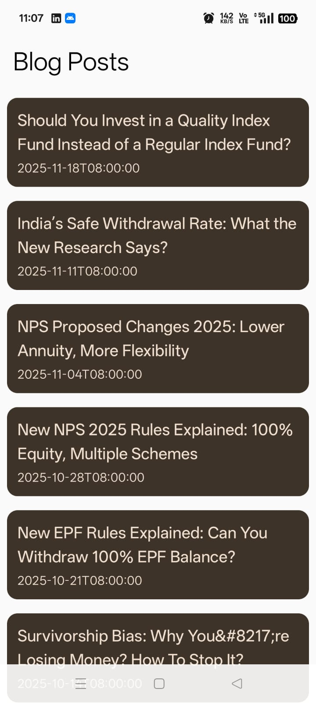
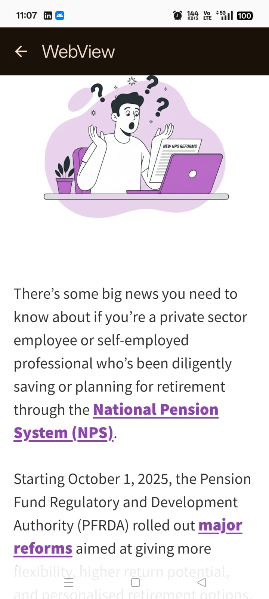

# 📰 BlogReaderApp

A modern Android Blog Reader app built with **Kotlin** and **Jetpack Compose** using clean architecture and modern Android libraries.  
The app fetches blog posts from a remote API and displays them efficiently using **Paging 3**, with smooth navigation and a built-in **WebView** for reading full articles.

---

## ✨ Features

- 📄 Fetch and display blogs from REST API
- ⚡ Jetpack **Compose UI**
- 📚 Infinite scrolling using **Paging 3**
- 🌐 Built-in **WebView** to read full blog posts
- 🧭 Clean navigation using **NavHost**
- 🧪 Modern **MVVM architecture**
- 🔄 Automatic refresh & smooth pagination
- 💉 Dependency Injection with **Hilt**

---

## 🧱 Tech Stack

- **Language**: Kotlin
- **UI**: Jetpack Compose + Material3
- **Architecture**: MVVM
- **Networking**: Retrofit + OkHttp
- **Pagination**: Paging 3
- **Dependency Injection**: Hilt
- **Async**: Kotlin Coroutines & Flow


---

## 🖼️ Screenshots

| Blog List | WebView Screen |
|----------|---------------|
|  |  |


## 🛠️ How to Run

Clone the repository:

```bash
git clone https://github.com/Manash396/VridAssignement.git

cd VridAssignement

